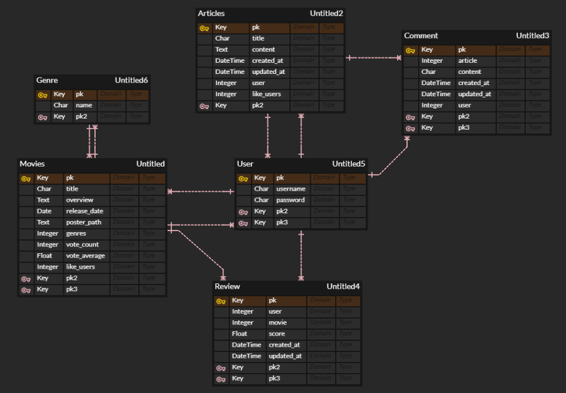

[TOC]

# SSA-NEMA

## 1. 팀원 정보 및 업무 분담

SSANEMA

구미 2반 채민지, 구미 2반 임소연

### 5월 19일(목)

- 전체 구조

- ERD

- 목업

- 채민지 - 서버
  - 로그인/회원가입/로그아웃
  - 모델짜기
  
- 임소연 - 클라이언트
  - 구조 틀 짜기
  - 라우터, 링크 정리
  
  

### 5월 20일(금)

- 채민지 - 서버
  - 영화 데이터 수집
  - 모델링
  - 시리얼라이저
- 임소연 - 클라이언트
  - 로그인/회원가입/로그아웃 연결
  - 메뉴, 풋바

### 5월 23일(월)

- 채민지

  - 커뮤니티
  - 게시글, 좋아요

- 임소연

  - 영화 목록 (평점, 랜덤)

  - 영화 세부사항

    

### 5월 24일(화)

- 채민지

  - 게시글, 댓글
  - 생일 영화 추천
  - MD 영화 추천

- 임소연

  - 영화 찜
  - 메뉴바

  - 장르별 영화 추천
  - 시간별 영화 추천

### 5월 25일(수)

- 채민지
  - 커뮤니티 꾸미기 (게시글, 댓글, 좋아요)
  - 영화목록 이상한거 버리기
  - 생일 영화 추천 꾸미기
  - MD 영화 추천 꾸미기
- 임소연
  - 영화들 카드형태 꾸미기 (목록,장르,시간)
  - 로그인안해도 영화 목록 볼수있게
  - 영화 세부사항 꾸미기 (찜, 리뷰)

### 5월 26일(목)

- 오류 수정
- 채민지

  - 전체 구조 다듬고 꾸미기
  - 메뉴, 풋바 꾸미기
  - 프로필 꾸미기

- 임소연

  - 회원가입, 로그인, 로그아웃 꾸미기
  - Top 버튼
  - 글씨체 적용
  - PPT 만들기

## 2. 목표 서비스 구현 및 실제 구현 정도

- 어떤 영화 봐야할 지 모르겠을 때

- 내가 본 영화, 평점을 등록하고 싶을 때

- 다른 사람은 이 영화를 어떻게 생각할까 궁금할 때

사용할 수 있는 영화 추천 커뮤니티 서비스를 구현한다.

## 3. 데이터베이스 모델링(ERD)

## 4. 필수 기능

### 계정

- 회원 가입
  - SSANEMA에 가입
- 로그인, 로그아웃
  - 커뮤니티 기능
    - 게시글
    - 댓글
    - 좋아요
  - 영화 평가 및 찜 기능
- 프로필
  - 찜한 영화
  - 작성한 게시글
  - 좋아요한 게시글

### 커뮤니티

- 게시글
  - 작성, 수정, 삭제
- 게시글 좋아요
  - 마음에 드는 게시글에 좋아요
- 댓글
  - 각 게시글에 작성, 수정, 삭제

### 영화

- 평점순, 랜덤 추천
  - 평점이 높은 10개 영화
  - 랜덤 10개 영화
- 장르별 추천
  - 로맨스, 판타지, 액션 등 장르별 영화
- 시간별 추천
  - 현재 시간에 따른 영화 추천
- 생일별 추천
  - 유저의 생일에 개봉한 영화 추천
- MD 추천
  - MD가 추천하는 영화
- 영화 세부사항
  - 영화 줄거리, 장르, 평점
  - 평점 작성, 수정, 삭제
  - 마음에 드는 영화 찜

## 5. 느낀 점

### 채민지

처음으로 일주일 프로젝트를 진행했습니다. 
처음 계획을 세울 때는 해봤던 기능들이 많으니 금방 끝낼 줄 알았는데 제 생각보다 훨씬 할 일이 많아 힘들었습니다.
장고(서버)는 조금 버벅이긴 했지만 생각보다 잘 진행이 되어 빨리 끝나서 뿌듯했습니다.
뷰(클라이언트)는 장고보다는 낯설지만 구현하는 것은 몇번 반복하다보니 비슷한 부분이 많아서 잘 해결되었습니다.
문제는 배치 및 꾸미기였습니다. 제가 예상했던 곳이 아닌 다른 곳에 배치되거나 A를 건드렸더니 D가 작동되지 않는 경우가 많아 당황스러웠습니다.
진행 계획을 세울 때 기능을 다 구현한 뒤 디자인을 해야겠다 라고 생각해서 그대로 진행했었는데 다음 프로젝트부터는 동시에 해야겠다고 생각했습니다.
디자인을 하면서 기능코드에 수정이 종종 있어 더 헷갈렸습니다.
프로젝트 초반에는 자신만만했다가 중반에는 내가 할 수 있는건가 라는 의심이 들고 생각대로 되지 않아 스스로에게 화나고 힘들었습니다. 일주일을 다 하고 나니 장고와 뷰를 프로젝트 전보다 많이 응용할 줄 알게 되어 스스로 성장한 기분이 들어 뿌듯했습니다.
프로그램 공부 시 책으로 공부하는 것보다 프로젝트 하나 구현하는 것이 더 공부가 많이 된다는 말을 많이 들었는데 이번에 직접 경험했습니다.
이번에 세세한 부분을 하지 못한 꾸미기는 더 공부해서 다음 프로젝트 때는 제대로 구현하고 싶습니다.

### 임소연

일주일간의 프로젝트가 처음이라 시작할 때는 자신만만했습니다. 시간도 많고 페어와 함께하는 프로젝트니 해볼만 하겠다고 생각했습니다. 하지만 프로젝트를 시작하고 어려움이 닥치자 점점 힘들어졌습니다. 

여태껏 pull, push만 하던 git도 페어와 함께 파일을 수정하기 위해 branch를 사용하면서 많은 어려움을 겪었습니다. 특히 서로 같은 파일을 수정해서 merge할 때 충돌이 발생하면서 당황스러웠습니다. 교수님에게 도움을 받아가면서 git 문제를 해결했습니다.

오류는 생각보다 이곳저곳에서 많이 튀어나왔습니다. 하나의 오류를 해결하면 또 새로운 오류가 생기고, 그 오류를 고치면 또 다시 새로운 오류가 생겼습니다. 짜증도 나고 해결할 줄 몰라서 같은 반 교육생 친구들에게 도움을 청하기도 했습니다. 하루종일 프로젝트를 붙잡고 있는데 진도는 더뎌 힘들었습니다.

하지만 힘들었던 만큼 얻은 것도 굉장히 많습니다. 먼저 그렇게 속을 썩였던 git branch를 이제는 꽤 능숙하게 잘 쓸 수 있다는 점입니다. 2학기에 이어질 팀 프로젝트에서도 사용될 기능이기 때문에 현재에 안주하지 않고 더 많이 익혀두어야겠습니다.

서버와 클라이언트의 차이, 장고와 뷰를 왜 나누는지도 정확하게 몰랐던 제가 이제는 어떤 기능을 구현하기 위해서는 어떤 장고의 기능과 어떤 뷰의 기능이 필요한지 깨달았습니다. 수업만으로는 부족했던 실전감각이 직접 프로젝트를 구현하면서 확실하게 손에 익었습니다. 추천 알고리즘을 구현하는 데에는 많은 아이디어가 필요하고, 그것을 실제로 구현한다는 것은 어려웠습니다. 

프론트엔드를 꾸미는 데 있어서도 많은 공을 들였습니다. 처음에는 기능을 모두 완벽하게 구현하고 마지막에 화면을 꾸미는 게 좋겠다고 생각했지만, 막상 뒤늦게 꾸미자니 변경해야 할 부분도 생겨 오류도 많이 생겼습니다. 교수님의 조언대로 다음 프로젝트부터는 기능을 구현하면서 꾸미기도 함께 다듬어가야겠습니다.

하루종일 붙잡고 노력해서 만들어낸 이번 프로젝트 결과물을 바탕으로 앞으로의 프로젝트는 발전한 모습으로 수행하겠습니다.

